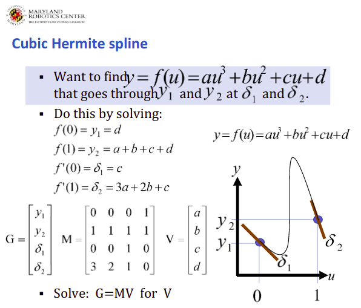

# Waypoint reduction using Cubic Hermite spline curve fitting
[](https://github.com/RajPShinde/waypoint_reducer/blob/master/LICENSE)

## Authors
* **Raj Prakash Shinde** [GitHub](https://github.com/RajPShinde)

## Description
A python script to reduce the way points for a robot while still trying to retain the original path trajectory

## Dependencies
1. Ubuntu 16.04+
2. python 2.7
3. ROS Kinetic+
4. OpenCV 
5. Numpy
6. Matplotlib

## Output
**N=3**
<p align="center"></p>
**N=7**
<p align="center"></p>
**N=70 with closeup**
<p align="center"></p>

## Assumptions
1. Robot is Non-holonomic. (Car)
2. Robot MUST pass through the waypoint with required orientation.
3. Waypoints are given after specific time Interval.
4. No restriction on turn that the robot can perform.

## Approach
When the user specifies the number of waypoints N. we select those N waypoints (except for start and goal points) from the already available 992 waypoints such that they are equally spaced in time.
<br>As we have decided the N waypoints, Now we need to plan a path passing through the waypoints which is as close as possible to the original Trajectory. For that we use the x,y and Orienation the robot with for the selected waypoints. The coordinates and tanget vector/Orientation for 2 consecutive waypoints are solved using an Interpolating Splines method called Cubic Hermite Spline to find the path between them. This is done for every two consecutive waypoints. This is basically curve fitting for the waypoints while considering the slopes. THe robot here is assumed to be non-holonomic.
<p align="center"></p>

## Build
Steps to build
```
mkdir -p ~/catkin_ws/src
cd ~/catkin_ws/
catkin_make
source devel/setup.bash
cd src/
git clone https://github.com/RajPShinde/waypoint_reducer
cd waypoint_reducer/scripts
chmod gu+x waypoint_reducer.py
cd ~/catkin_ws/
catkin_make
```
## Run
**Run Rosmaster**
<br> Open a new Terminal using Ctrl+T
```
roscore
```

**Run Script**
<br> Open a new Terminal using Ctrl+T (i.e make sure you are in catkin_ws directory)
```
source devel/setup.bash
rosrun waypoint_reducer waypoint_reducer.py
```

**Run Bag File**
<br>**Note**- Make sure the bag File for the waypoint reducuction question is already present in the catkin_ws folder
<br> Open a new Terminal using Ctrl+T (i.e make sure you are in catkin_ws directory)
```
rosbag play path_test.bag
```